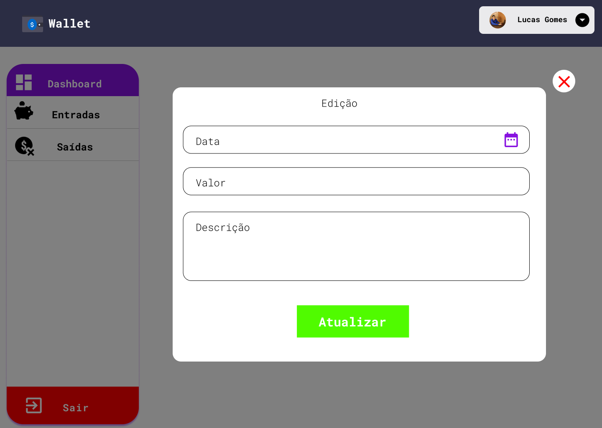

<div align="center">
    
</div>

<h3 align="center">Dashboard interativa para controle de entradas e saídas</h3>

---
## :art: Layout
[Figma](https://www.figma.com/)

---
## :gear: Techs
- [NextJS](https://nextjs.org/)
- [ReactJS](https://reactjs.org/)
- [Axios](https://axios-http.com)
- [Redux](https://redux.js.org/)
- [Redux Toolkit](https://redux-toolkit.js.org/)
- [Firebase](https://firebase.google.com/)
- [Moment](https://momentjs.com/)
- [React Count Up](https://react-countup.vercel.app/)
- [React Hook Form](https://react-hook-form.com/)
- [Yup](https://www.npmjs.com/package/yup)
- [SASS](https://sass-lang.com/)
- [UUID](https://www.npmjs.com/package/uuid)
- [JWT Cookie](https://www.npmjs.com/package/jwt-cookie)

---
## :book: Features

### Login
<div align="center">
    
</div>

- [x] Verificação de email e senha
- [x] Login com Google

### Criar conta
<div align="center">
    
</div>

- [x] Registro através de email e senha

### Início
<div align="center">
    
</div>

- [x] Listagem do total em conta medindo a diferença entre entradas e saídas
- [x] Listagem de todas as entradas
- [x] Listagem de todas as saídas
- [x] Gráficos interativos
### Opções de entradas
<div align="center">
    
</div>

- [x] Listagem de entradas
- [x] Criação de novas entradas
### Criação de entrada
<div align="center">
    
</div>

- [x] Criação de nova entrada
- [x] Gerenciamento de erros
- [x] Validação do formulário de criação com Yup e React Hook Form
### Listagem de entradas
<div align="center">
    
</div>

- [x] Listagem de todas as entradas cadastradas no Firebase
### Opções de saídas
<div align="center">
    
</div>

- [x] Listagem de entradas
- [x] Criação de novas entradas

### Criação de saídas
<div align="center">
    
</div>

- [x] Criação de nova saída
- [x] Gerenciamento de erros
- [x] Validação do formulário de criação com Yup e React Hook Form
### Listagem de saídas
<div align="center">
    
</div>

- [x] Listagem de todas as saídas cadastradas no Firebase
### Edição de entradas/saídas
<div align="center">
    
</div>

- [x] Modal para edição da entrada ou saída selecionada
- [x] Atualização diretamente no Firebase

---
## :desktop_computer: Como usar
-- É necessário a criação de uma aplicação Web no Firebase, utilização do Realtime Database e preenchimento das chaves abaixo
```
NEXT_PUBLIC_API_KEY=
NEXT_PUBLIC_AUTH_DOMAIN=
NEXT_PUBLIC_DATABASE_URL=
NEXT_PUBLIC_PROJECT_ID=
NEXT_PUBLIC_STORAGE_BUCKET=
NEXT_PUBLIC_MESSAGING_SENDER_ID=
NEXT_PUBLIC_APP_ID=
```
-- Após isso é necessário rodar no terminal o comando abaixo:
```
    yarn dev
```
-- Abrir uma aba no navegador e digitar localhost:3000
---
## :spiral_notepad: License
Arquivos sob a licença [MIT](https://github.com/lucasgomesgp) criado por Lucas Gomes.
